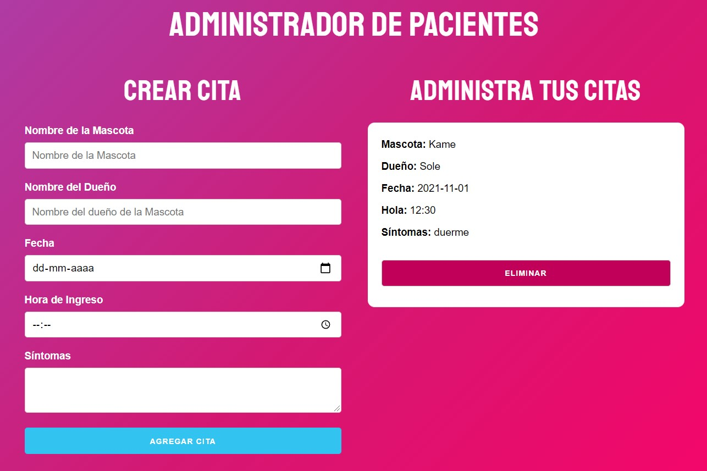

## Administrador de Pacientes

Puntos tratados en la práctica

- Trabajar con el formulario
- Leer contenido de sus inputs
- Validar formulario
- Uso del localStorage
- ✨Utilizar useState y useEffect✨

[Ver Proyecto](https://jfelixzuniga.github.io/React_Practice/administrador-citas/build/)

    

