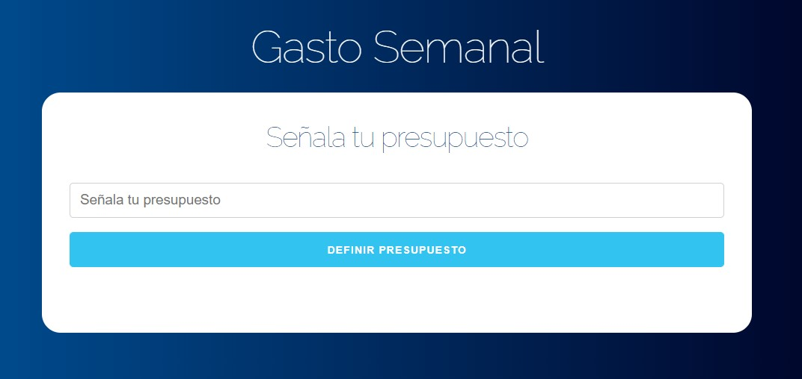
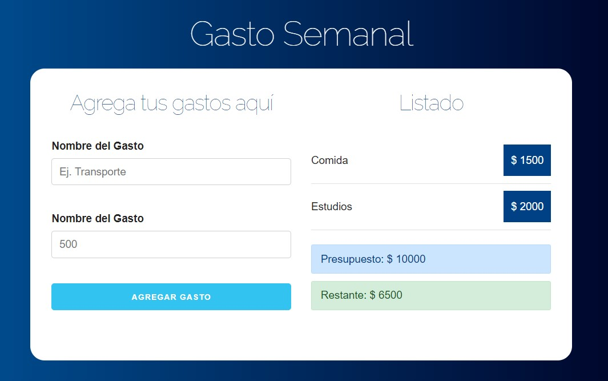

## Administrador de Pacientes

Puntos tratados en la práctica

- Trabajar con el formulario
- Renderizado condicional
- ✨Utilizar useState y useEffect✨

[Ver Proyecto](https://jfelixzuniga.github.io/React_Practice/control-presupuesto/build/)

    

    

