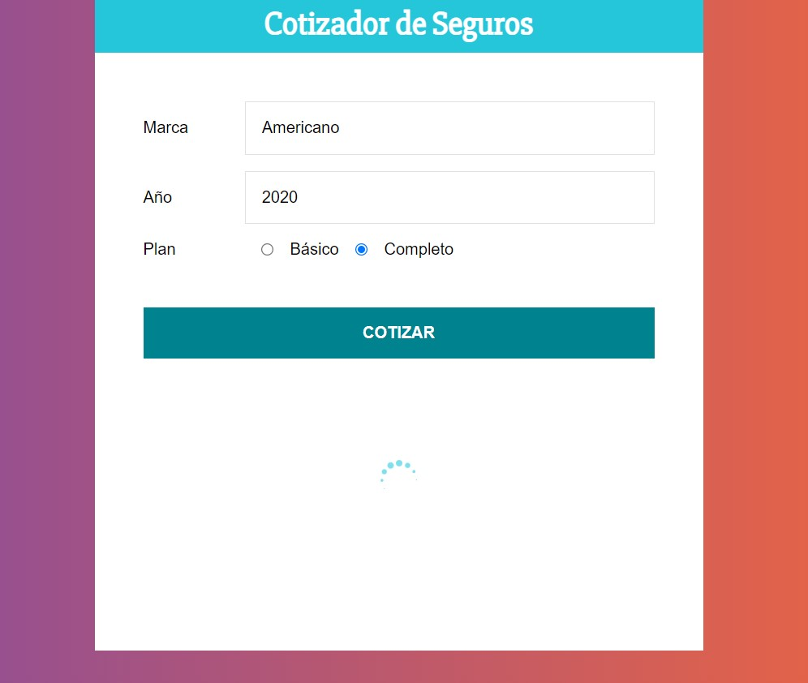
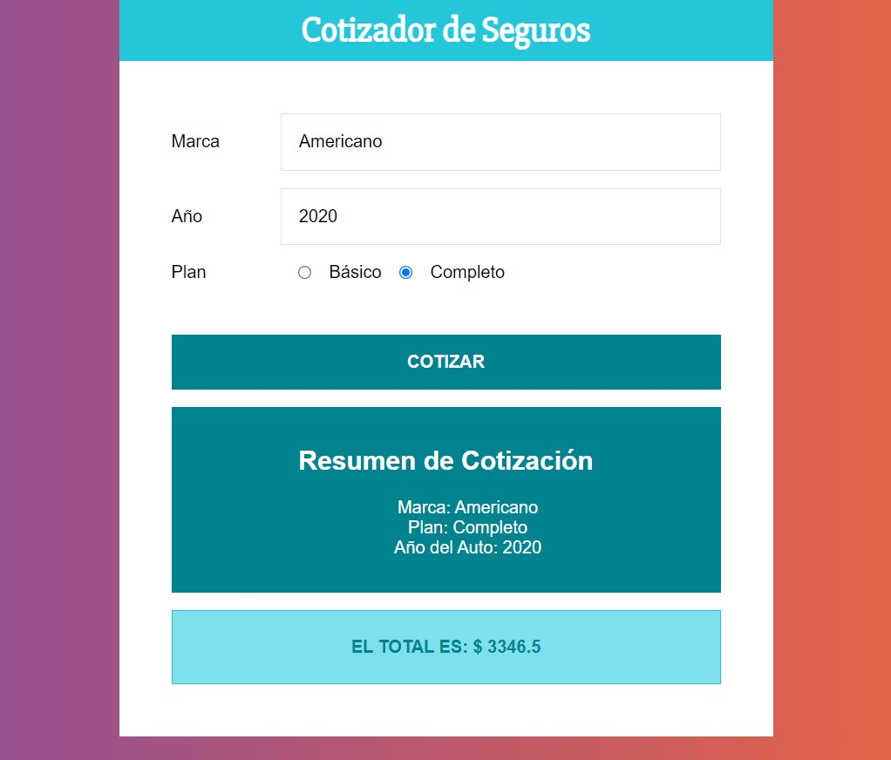

## Cotizador de Seguros

Puntos tratados en la práctica

- Trabajar con el formulario
- Renderizado condicional
- ✨Uso de CSS-in-JS con Emotion✨

[Ver Proyecto](https://jfelixzuniga.github.io/React_Practice/cotizador/build/)

    

    

